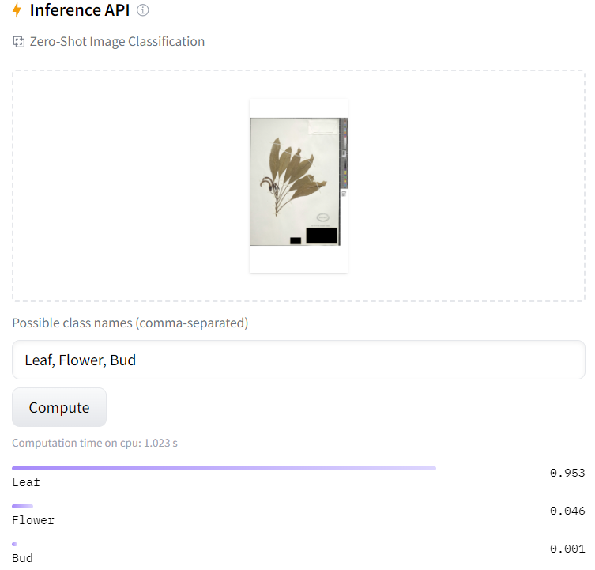

# Experiments Evaluating and Finetuning CLIP

## Notes from paper:

CLIP has dataset of 400 million (image, text) pairs
Natural Language supervision
CLIP is pre-trained to predict if an image and a text snippet are paired together in its dataset
Might be able to perform best with samples of each species.

## Experiments:

### Initial Tests

TODO: add next level of details with image thumbnails and output class probabilities.

* Initial test with random herbaria sample (against 5 classes -- flower, rock, herb, man, tree with true class given as plant): Produced correct output since the class labels were simple and varied. Ranked order of classification results were plant, herb, tree, flower and man. 

* Test with 3 images with different taxons against a total of 6 possible Taxons. Taxon gave correct prediction (gave 4 other taxons in the class): Produced correct output for a few samples with highest probability of correct class but is inconsistent. 

* Objective : Evaluate anecdotally by providing herbaria samples and asking if it can identify plant species. Also try asking about existence of fruits, flowers or buds. Could also ask specifically about phenology of the plant. Start with entire image. Perhaps experiment with crop of the plant only, or with labels blurred.

### Experiment 1

* Experiment : with 10 image dataset and 1008 classes from taxon GT
=> Evaluation : Against top 5 predictions by CLIP
=> Result : Accuracy = 0%

### Experiment 2

* Experiment : with 10 image dataset and same 10 classes from taxon GT
=> Evaluation : Against top 5 predictions by CLIP
=> Result : Accuracy = 30%

### Experiment 3

* Experiment : with 10 image dataset and 1008 classes from taxon GT
=> Evaluation : Against top 10 predictions by CLIP
=> Result : Accuracy = 0%

* Out of 10 images, only 1 of them had accuracy over 10% through this method

### Experiment 4

* Tried zero-shot experiments on the hugging face model : [https://huggingface.co/openai/clip-vit-large-patch14](openai/clip-vit-large-patch14)

* For Leaf, Bud, Flower identification:
Since most samples inevitably always include leaves, highest class goes to leaves.
Interestingly for some samples with a flower, probability of flower is more than Bud, but less than leaf.
CLIP does understand the demarcation within a single image that could be fine-tuned or trained for these queries

* For Taxon identification:
It seems as if CLIP does perform OCR since it gives the correct class for the images which have clear printed text of Taxon name on it. On omitting the label next time, the model still retains the knowledge of the species and gives the correct class (tested manually with 2 samples)
Could be due to large CLIP model performing better than base 32
Translating to code for a whole dataset may need resources

* ### Test 1 OCR Taxon task

* Evaluation 1 : If ground truth label lies within top 5 of the predicted labels then count as 1 => Experiments for 10 samples Taxon same as ViT-B32 : Accuracy = 60%

* Evaluation 2 : If ground truth label lies within top 3 of the predicted labels then count as 1 => Experiments for 10 samples Taxon same as ViT-B32 : Accuracy = 20%

* ### Test 2 OCR Taxon task with labels blacked out

* Evaluation 1 : If ground truth label lies within top 5 of the predicted labels then count as 1 => Experiments for 10 samples Taxon same as ViT-B32 : Accuracy = 50%

* Evaluation 2 : If ground truth label lies within top 3 of the predicted labels then count as 1 => Experiments for 10 samples Taxon same as ViT-B32 : Accuracy = 40%